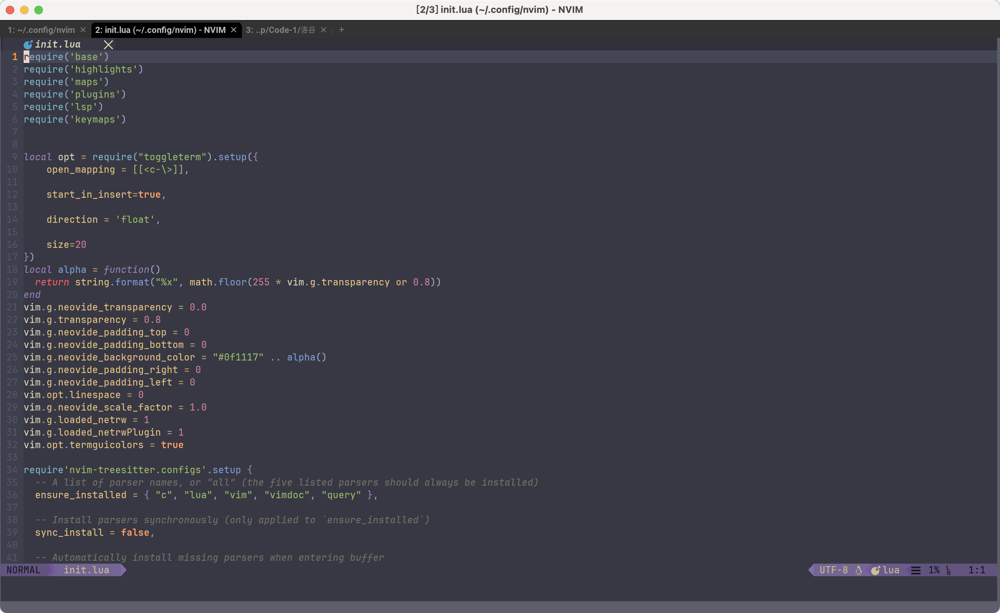
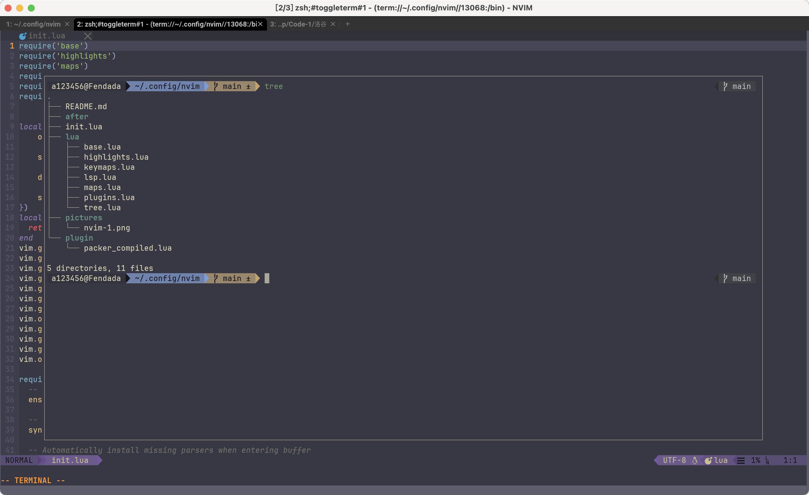
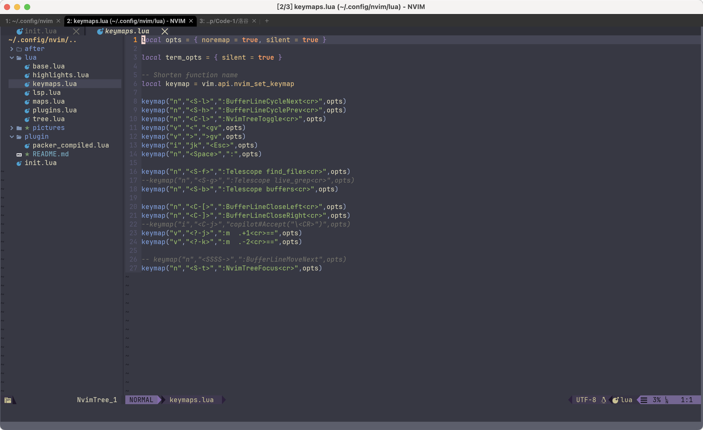
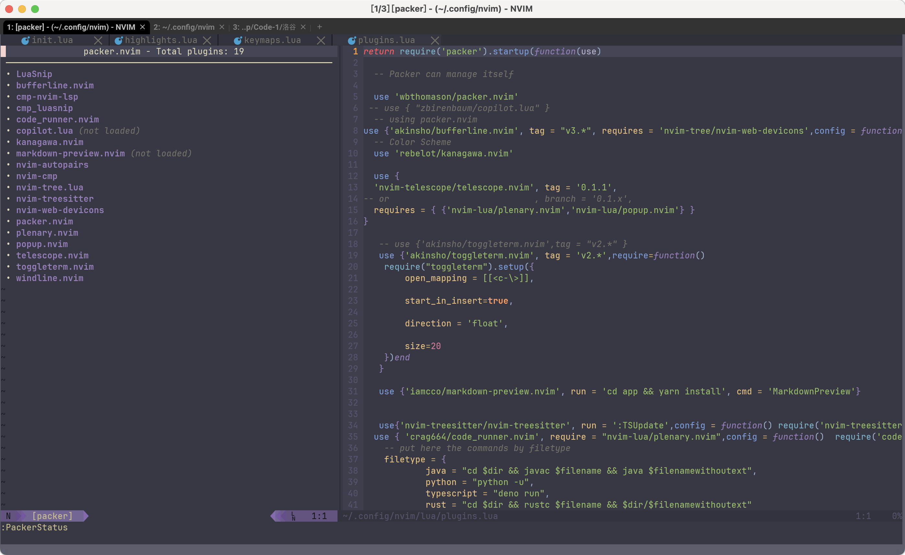

# Nvim config
## Looks like





## Introduction
This nvim config is based on packer.nvim in 100% lua.
And this one runs on my macos.

You can run`:PackerStatus`to see what plugins are loaded.


## Start up
* If you don't have a packer, see [Packer.nvim](https://github.com/iamcco/markdown-preview.nvim.git) first.
* Then run 
```shell
git clone https://github.com/fen-dada/nvim.git
```
* Enter a file in nvim and run `:PackerInstall` to install or `:PackerSync` to install and compile all the plugins. 

## Shortcuts
```lua
keymap("n","<C-l>",":NvimTreeToggle<cr>",opts) //<Ctrl + l> to toggle the file tree structure

keymap("n","<S-t>",":NvimTreeFocus<cr>",opts) // <Shift + t> to focus on the NvimTree

keymap("n","<S-l>",":BufferLineCycleNext<cr>",opts) // <Shift + l> to jump to the right tag file

keymap("n","<S-h>",":BufferLineCyclePrev<cr>",opts) // <Shift + h> to jump to the left tag file

keymap("i","jk","<Esc>",opts) // <j + k> mapping to <Esc>

keymap("n","<Space>",":",opts) // <Space> mapping to ":"

keymap("n","C-\",:ToggleTerm<cr>",opts) // <Ctrl + \> to toggle terminal in nvim
```
Keys | Function
---- | --------
<Ctrl + l> | toggle NvimTree
<Shift + t> | focus on the Nvimtree
<Shift + h> | jump to the left tag file
<Shift + l> | jump to the right tag file
<j + k> | mapping to \<Esc>
\<Space> | mapping to ":"
<Ctrl + \> | toggle the terminal in nvim
